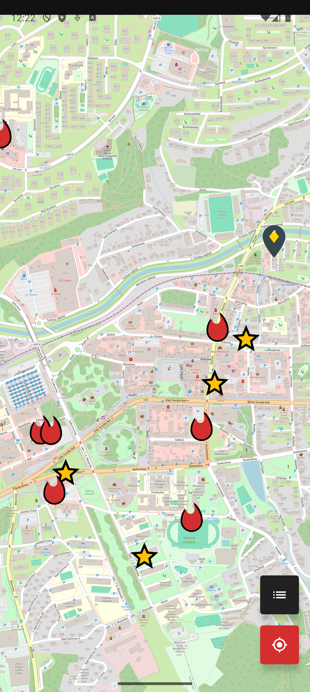
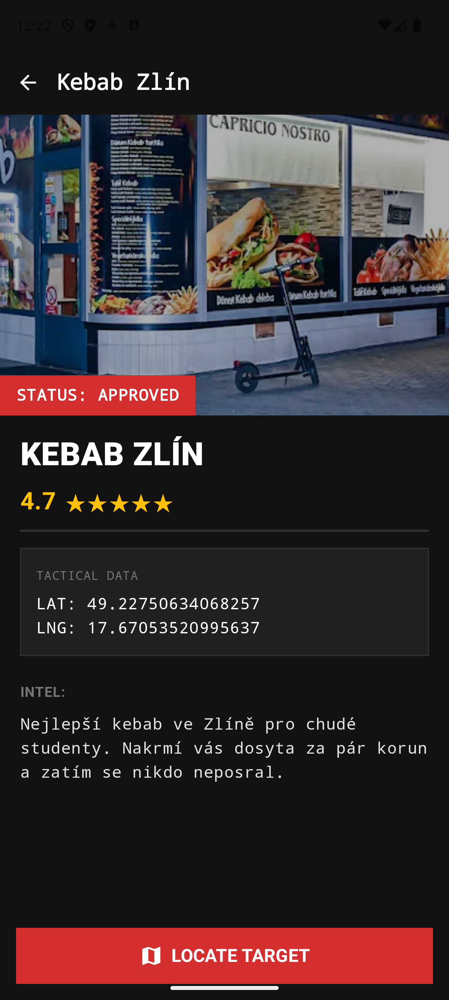
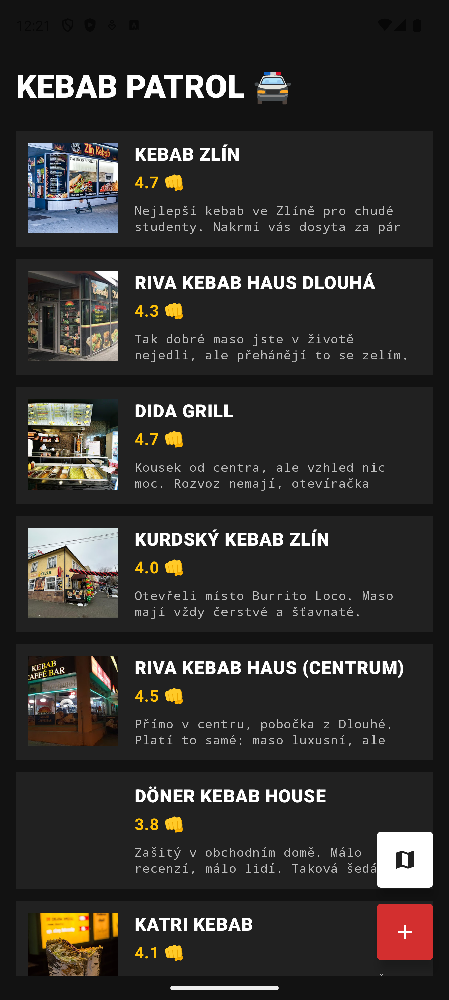
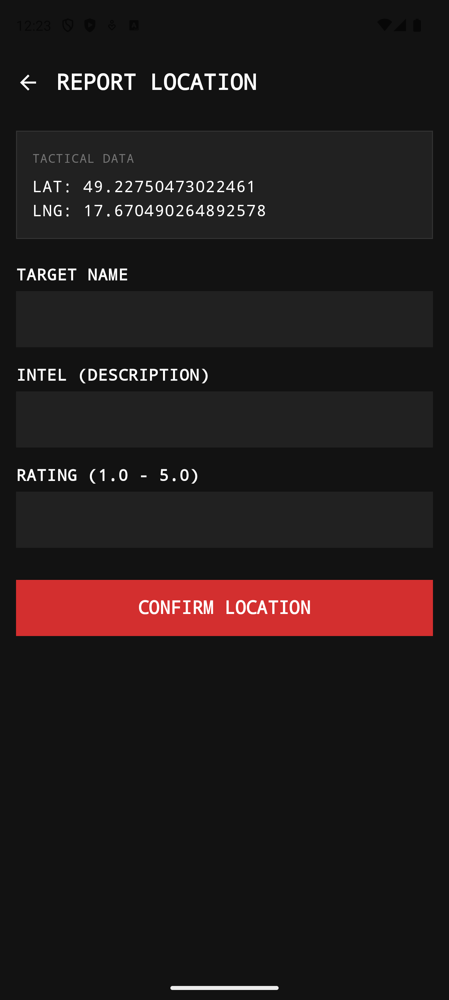

# 🥙 KEBAB PATROL


> **"Target Locked. Hunger Eliminated."**

**Kebab Patrol** is a tactical utility application designed for locating, rating, and cataloging the best shawarma/kebab spots in the city. Built with a **Brutalist Design Philosophy**, it prioritizes raw data, high contrast, and efficiency over standard aesthetic norms.

---

## 📱 INTERFACE & VISUALS

The app features a custom **Dark Industrial UI**: clear edges, monospace typography, and high-contrast indicators.

| **SPLASH & ENTRY** | **TACTICAL MAP** | **INTEL (DETAILS)** |
|:---:|:---:|:---:|
|  |  |  |
| *Immediate boot sequence* | *OSM Map with Elite/Standard markers* | *Detailed dossier on the target* |

| **THE REGISTRY** | **REPORT LOCATION** |
|:---:|:---:|
|  |  |
| *Database of known locations* | *GPS coordinate fixing & submission* |

---

## 🛠 TECH STACK (THE ARSENAL)

The project is built using modern Android development standards (MAD) with a focus on Clean Architecture.

* **Language:** Kotlin
* **UI:** Jetpack Compose (Material3)
* **Architecture:** MVVM (Model-View-ViewModel) + Clean Architecture
* **Dependency Injection:** Dagger Hilt
* **Asynchronous:** Coroutines & Flow
* **Local Data:** Room Database
* **Maps:** OSMDroid (OpenStreetMap)
* **Navigation:** Jetpack Navigation Compose

---

## 🔥 KEY FEATURES

### 1. Tactical Map (OSMDroid)
* **Real-time GPS Tracking:** Locates the user immediately.
* **Tiered Marker System:**
    * 🔥 **Fire Marker:** Standard approved locations.
    * 👑 **Gold Star:** Elite tier locations (Rating > 4.5).
* **Custom Overlays:** Clean, interference-free map interface.

### 2. The Dossier (Detail Screen)
* Visualizes kebab spots as "Case Files".
* **Status Badges:** Automatically assigns `APPROVED` or `HAZARD` status based on rating.
* **Direct Navigation:** "LOCATE TARGET" button launches external maps (Google Maps) for routing.

### 3. Field Reporting (Add Screen)
* User can pin their current location.
* **Input Validation:** Ensures no empty reports are filed.
* **Instant Feedback:** System Toasts and Snackbars confirm data submission.

### 4. Reactive Data Layer
* Utilizes `Flow` from Room DAO to UI.
* Adding a new spot instantly updates the Map and List without manual refreshing.

---

## 🚀 HOW TO RUN

1.  **Clone the repository:**
    ```bash
    git clone [https://github.com/YOUR_USERNAME/KebabPatrol.git](https://github.com/YOUR_USERNAME/KebabPatrol.git)
    ```
2.  **Open in Android Studio:** (Ladybug or newer recommended).
3.  **Sync Gradle:** Let it download the heavy artillery.
4.  **Run:** Select an emulator or physical device and hit **Run**.

> *Note: Location permissions are required for the tactical map to function correctly.*

---

## 📂 PROJECT STRUCTURE

```text
com.example.kebabpatrol
├── data                # Data Layer (API, Room, Repository Impl)
├── di                  # Hilt Modules
├── domain              # Domain Layer (Models, Repository Interface, UseCases)
├── presentation        # UI Layer
│   ├── navigation      # NavGraph & Routes
│   ├── screens         # Compose Screens (Map, List, Add, Details)
│   ├── viewmodel       # ViewModels
│   └── theme           # Brutalist Design Theme
└── MainActivity.kt     # Entry Point
```

---

## ⚖️ LICENSE
This project is classified. Use at your own risk. (MIT License)
